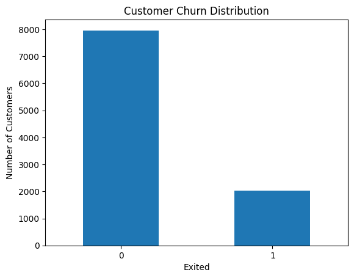
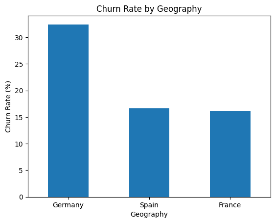
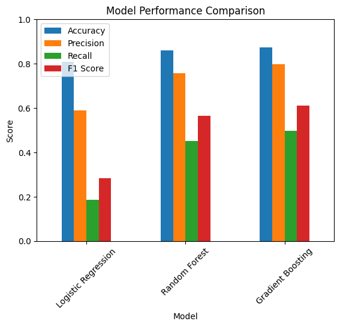

# Banking Customer Churn Analysis

## Project Overview

This project analyzes customer churn in a retail banking context using Python.

The goal is to understand which customer characteristics are associated with churn and to build machine learning models that can help identify customers who are more likely to leave the bank.

The project includes data cleaning, exploratory data analysis, customer segmentation, correlation analysis, machine learning modeling, model comparison, and business recommendations.

## Tools Used

- Python
- pandas
- NumPy
- matplotlib
- scikit-learn
- Jupyter Notebook
- GitHub

## Dataset

The dataset contains customer-level banking information, including demographics, credit score, geography, account balance, product usage, activity status, estimated salary, and churn status.

The target variable is:

`Exited`

Where:

- `0` = customer stayed
- `1` = customer churned

Main features used:

- `CreditScore`
- `Geography`
- `Gender`
- `Age`
- `Tenure`
- `Balance`
- `NumOfProducts`
- `HasCrCard`
- `IsActiveMember`
- `EstimatedSalary`
- `Exited`

## Project Structure

```text
banking-customer-churn-analysis/
├── README.md
├── requirements.txt
├── data/
│   └── churn.csv
├── images/
│   ├── churn_distribution.png
│   ├── churn_by_geography.png
│   └── model_comparison.png
└── notebooks/
    └── banking_churn_analysis.ipynb
```

## Analysis Sections

### 1. Data Loading and Initial Overview

Loaded the dataset and checked the number of rows, columns, data types, and summary statistics.

### 2. Data Cleaning

Checked missing values, duplicate rows, and removed columns that were not useful for churn analysis:

- `RowNumber`
- `CustomerId`
- `Surname`

### 3. Target Variable Analysis

Analyzed the churn distribution using the `Exited` variable.

The dataset contains **10,000 customers**:

- **7,963 customers** stayed with the bank
- **2,037 customers** churned

The overall churn rate is **20.37%**.

This means that approximately **1 out of 5 customers left the bank**.



### 4. Categorical Feature Analysis

Analyzed churn patterns across categorical variables:

- Geography
- Gender
- Credit card ownership
- Active membership

The goal was to identify whether certain customer groups had higher churn rates.



### 5. Numerical Feature Analysis

Compared numerical variables between customers who stayed and customers who churned.

Main variables analyzed:

- Credit score
- Age
- Tenure
- Balance
- Number of products
- Estimated salary

### 6. Customer Segmentation

Created simple customer segments based on:

- Age group
- Balance group
- Activity status

The goal was to make the analysis more business-oriented and easier to interpret for retention strategy.

### 7. Correlation Analysis

Checked relationships between numerical variables and churn.

Main findings:

- Age had the strongest positive relationship with churn
- Balance also had a positive relationship with churn
- Estimated salary had almost no relationship with churn
- Credit score, tenure, and number of products had weak negative relationships with churn

### 8. Machine Learning Models

Three machine learning models were trained and compared:

- Logistic Regression
- Random Forest
- Gradient Boosting

The goal was to predict whether a customer would churn.

## Model Results

| Model | Accuracy | Precision | Recall | F1 Score |
|---|---:|---:|---:|---:|
| Logistic Regression | 0.81 | 0.59 | 0.19 | 0.28 |
| Random Forest | 0.86 | 0.76 | 0.45 | 0.57 |
| Gradient Boosting | 0.87 | 0.80 | 0.50 | 0.61 |



## Key Insights

- The overall churn rate was **20.37%**
- Older customers showed a higher tendency to churn
- Customers with higher balances may still be at risk of leaving
- Inactive customers are important to monitor for retention
- Gradient Boosting achieved the best model performance
- Recall is especially important in churn prediction because the business goal is to identify customers who may leave

## Business Recommendations

### 1. Focus on older customers

Age showed the strongest positive relationship with churn. The bank should monitor older customer segments more carefully and offer personalized retention campaigns.

### 2. Monitor high-balance customers

Customers with higher balances may have a stronger financial impact if they leave. The bank should identify high-balance customers with churn risk and provide premium retention offers.

### 3. Improve engagement of inactive customers

Inactive customers are more likely to churn because they have weaker engagement with the bank. The bank can encourage them to use more services, digital banking tools, and personalized offers.

### 4. Use churn prediction for targeted retention

The Gradient Boosting model can be used as a starting point for identifying customers who are more likely to churn.

Instead of applying the same campaign to all customers, the bank can focus retention actions on customers with higher predicted churn risk.

### 5. Improve the model before real business use

Before using the model in a real banking environment, further improvements could include threshold tuning, hyperparameter optimization, feature engineering, and additional transaction-level customer behavior data.

## Skills Demonstrated

- Python data analysis
- pandas data cleaning
- Exploratory data analysis
- Customer segmentation
- Churn rate analysis
- Data visualization
- Correlation analysis
- Logistic Regression
- Random Forest
- Gradient Boosting
- Model evaluation
- Business interpretation
- Customer retention recommendations

## Final Conclusion

This project demonstrates how Python and machine learning can support customer churn analysis in retail banking.

The analysis identified important churn-related patterns and compared three machine learning models.

Gradient Boosting achieved the best overall performance with **0.87 accuracy**, **0.80 precision**, **0.50 recall**, and **0.61 F1 score**.

The project shows how customer data can be used to support targeted retention strategies and data-driven decision-making in banking.